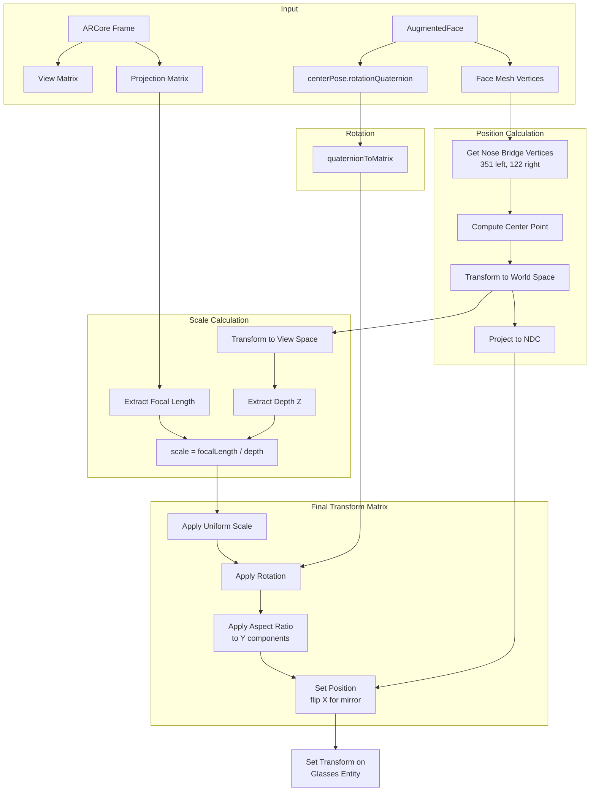

# Glasses Virtual Try-On (VTO)

A minimal Android app for virtual try-on of glasses using ARCore face tracking and Filament rendering.

## Requirements

- Android device with ARCore support and front-facing camera
- Filament `matc` tool for compiling materials
- Filament `cmgen` tool for compiling HDR to IBL

## Setup

### 1. Compile a Filament Material

Download the Filament tools and compile the camera background material:

```bash
 matc --api opengl --api vulkan --platform mobile -o ./app/src/main/assets/materials/camera_background.filamat ./app/src/main/assets/materials/camera_background.mat
```

### 2. Generate IBL from HDR env

```bash
cmgen --format=ktx --size=256 --deploy=./app/src/main/assets/envs/ ./app/src/main/assets/envs/neon_photostudio_2k.hd
```

### 3. Build and Run

```bash
./gradlew assembleDebug
adb install app/build/outputs/apk/debug/app-debug.apk
```


## Concepts

### Head rotation

- along X axis: Roll, tilt your head left/right
- along Y axis: Pitch, look up/down
- along Z axis: Yaw, turn left/right

## Glasses Transform Pipeline

The `GlassesRenderer.updateTransform()` function positions and scales the 3D glasses model to align with the user's face. Here's how it works:



### Key Design Decisions

#### 1. Depth-Based Scaling

**Problem**: When the user turns their head left/right, the apparent distance between facial landmarks (like pupils) decreases due to perspective foreshortening. Using this distance for scaling would incorrectly shrink the glasses.

**Solution**: Use the depth (Z distance from camera) to calculate scale instead:
```
scale = focalLength / depth
```
This ensures consistent glasses size regardless of head orientation - only distance from camera affects scale.

#### 2. Aspect Ratio Correction After Rotation

**Problem**: The screen has a non-square aspect ratio. Applying aspect ratio correction before rotation causes the glasses to skew when tilting the head left/right.

**Solution**: Apply uniform scale first, then rotation, then multiply the Y components of the rotation matrix columns by the aspect ratio:
```kotlin
tempMatrix16[1] *= aspectRatio  // Column 0, Y component
tempMatrix16[5] *= aspectRatio  // Column 1, Y component
tempMatrix16[9] *= aspectRatio  // Column 2, Y component
```
This stretches the result vertically in screen space without affecting the rotation.

#### 3. Using centerPose for Rotation

**Problem**: Computing rotation from face mesh vertices (eye positions, forehead) was complex and produced inconsistent results with skewing artifacts.

**Solution**: Use ARCore's `face.centerPose.rotationQuaternion` directly. It provides stable, accurate head orientation without additional computation.

#### 4. NDC Space Rendering

The glasses are rendered in NDC (Normalized Device Coordinates) space using an orthographic projection. This simplifies the transform pipeline:
- Position is set directly in NDC (-1 to 1 range)
- X is flipped for front camera mirror effect
- Z is set to -0.5 to render in front of the camera background

#### 5. Nose Bridge Positioning

The glasses are positioned at the nose bridge center, computed as the midpoint between vertices 351 and 122 from the [ARCore canonical face mesh](https://github.com/google-ar/arcore-android-sdk/blob/main/assets/canonical_face_mesh.fbx).